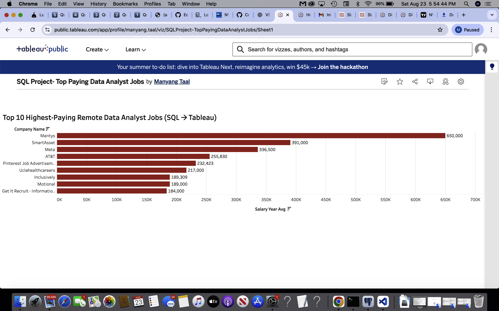
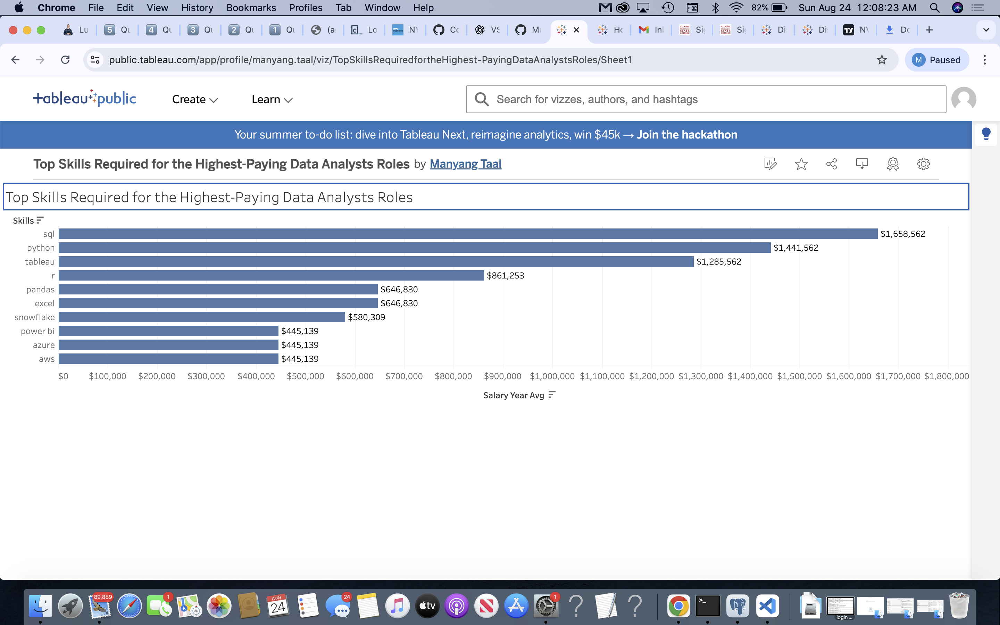
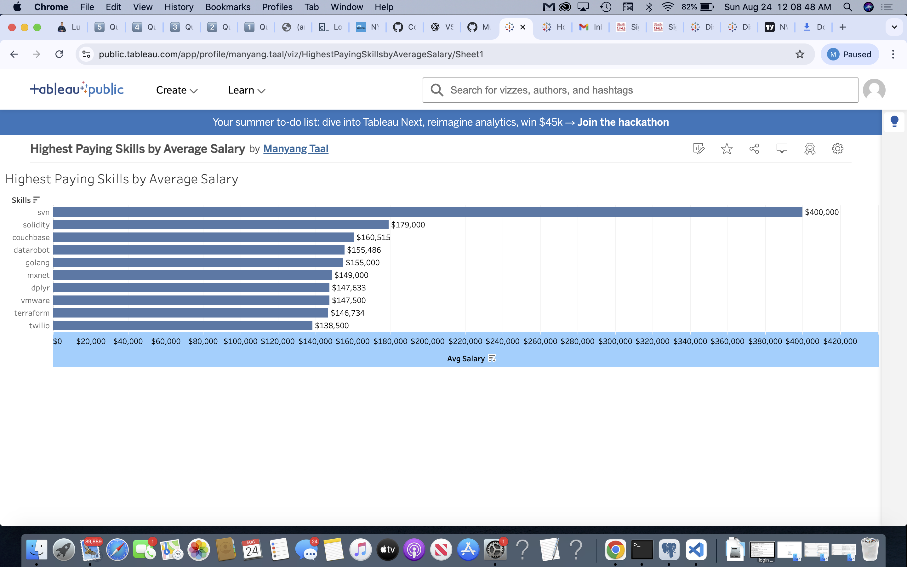
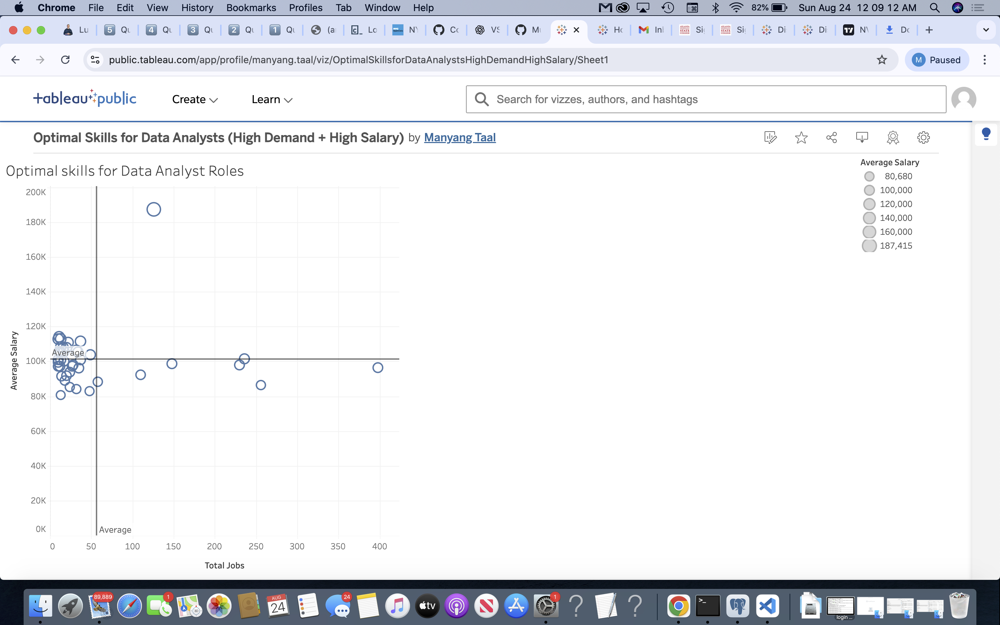

Data Analyst Job Market SQL Project

Overview
This project explores the data analyst job market using SQL queries and Tableau Dashboards.

The goal is to uncover insights about
-Top-paying roles
-In-demand skills
-Optimal skill combinations that maximize both salary and demand.

By analyzing job postings, salaries, and skill requirements, this project helps aspiring data analysts (like myself) and professionals understand where to focus career development efforts.

Dataset:
The data used in this project comes from a job postings dataset that includes:
  -Job titles, companies, and locations
  -Salary information (annual averages)
  -Required skills linked to each role

Tools & Skills Used
-SQL (PostgreSQL) → querying, joins, CTEs, aggregations
-Visual Studio Code → SQL development environment
-Tableau Public → visualizations and dashboards
-GitHub → version control & project documentation

Research Questions
1. What are the top-paying Data Analyst jobs?

Query Goal: Identify the top 10 highest-paying Data Analyst roles available remotely.

Filters only jobs with salary data and remote flexibility.

Helps highlight the best-paying opportunities in the market.

--Top 10 highest paying data analyst roles that are either remote or local
SELECT 
    job_id,
    job_title_short,
    job_location,
    salary_year_avg,
    name AS company_name
FROM 
    job_postings_fact
JOIN 
    company_dim
ON 
    job_postings_fact.company_id = company_dim.company_id
WHERE 
    job_title_short = 'Data Analyst'  
AND 
    job_location = 'Anywhere'
AND 
    salary_year_avg IS NOT NULL
ORDER BY 
    salary_year_avg DESC
LIMIT 10;

Key Takeaway:

  -Remote roles can reach up to $650K/year, showing extreme salary variation.
  
  -Senior/Director positions dominate the high-paying roles.

2️. What are the top-paying jobs and the skills required?

Query Goal: Combine salary insights with required skills for the top 10 remote jobs.

Helps align high-paying jobs with their skill requirements.

-- Gets the top 10 paying Data Analyst jobs 

WITH top_paying_jobs AS (
    SELECT
        job_id,
        job_title,
        salary_year_avg
    FROM
        job_postings_fact
    WHERE
        job_title_short = 'Data Analyst'
				AND salary_year_avg IS NOT NULL
        AND job_location = 'Anywhere'
    ORDER BY
        salary_year_avg DESC
    LIMIT 10
)
-- Skills required for data analyst jobs
SELECT
    top_paying_jobs.job_id,
    job_title,
    salary_year_avg,
    skills
FROM
    top_paying_jobs
	INNER JOIN
    skills_job_dim ON top_paying_jobs.job_id = skills_job_dim.job_id
	INNER JOIN
    skills_dim ON skills_job_dim.skill_id = skills_dim.skill_id
ORDER BY
    salary_year_avg DESC

Key Takeaway:

  -Top-paying jobs require a mix of SQL, Python, R, Tableau, plus cloud & big data tools (AWS, Snowflake, Hadoop).
  
  -Hybrid skills (analytics + engineering) are especially valuable.

3️. What are the most in-demand skills for Data Analysts?

Query Goal: Find the top 5 skills most frequently requested in job postings.

Provides a list of the most valuable skills to learn.

-- Identifies the top 5 most demanded skills for Data Analyst job postings
SELECT
  skills_dim.skills,
  COUNT(skills_job_dim.job_id) AS demand_count
FROM
  job_postings_fact
  INNER JOIN
    skills_job_dim ON job_postings_fact.job_id = skills_job_dim.job_id
  INNER JOIN
    skills_dim ON skills_job_dim.skill_id = skills_dim.skill_id
WHERE
  -- Filters job titles for 'Data Analyst' roles
  job_postings_fact.job_title_short = 'Data Analyst'
GROUP BY
  skills_dim.skills
ORDER BY
  demand_count DESC
LIMIT 5;

Key Takeaway:

  -SQL (92K postings) is the single most demanded skill.
  
  -Other must-haves: Excel (67K), Python (57K), Tableau (46K), Power BI (39K).
  
  -Analysts need a balance of programming + visualization tools.

4️. What are the top-paying skills for Data Analysts?

Query Goal: Determine which skills are associated with the highest average salaries.

Focuses on roles with salary data to show which skills increase earning potential.

-- Finds average salary per skill for Data Analyst jobs

SELECT 
   AVG(job_postings_fact.salary_year_avg) AS avg_salary, -- average salary for the skill
   skills_dim.skills 
FROM 
   job_postings_fact
INNER JOIN 
   skills_job_dim ON job_postings_fact.job_id = skills_job_dim.job_id
INNER JOIN 
   skills_dim ON skills_job_dim.skill_id = skills_dim.skill_id
WHERE 
   job_postings_fact.job_title_short = 'Data Analyst'
AND 
   job_postings_fact.salary_year_avg IS NOT NULL
GROUP BY 
   skills_dim.skills
ORDER BY 
   avg_salary DESC

Key Takeaway:

  -Specialized tools like Solidity, Couchbase, and Datarobot command the highest salaries ($160K–$400K+) but have low demand.
  
  -Frameworks like TensorFlow, PyTorch, and Kubernetes land in the $120K–$150K range.

5️. What are the most optimal skills to learn (high demand + high salary)?

Query Goal: Identify skills that are both in high demand and linked to high salaries.

Uses a combination of demand count and average salary.

Provides the best strategic insights for career development.

-- CTE: Count how many remote Data Analyst jobs require each skill

WITH skills_demand AS (
  SELECT 
    COUNT(job_postings_fact.job_id) AS total_jobs,
    skills_dim.skill_id,
    skills_dim.skills         
  FROM 
    skills_dim
  JOIN 
   skills_job_dim ON skills_dim.skill_id = skills_job_dim.skill_id
  JOIN 
   job_postings_fact ON skills_job_dim.job_id = job_postings_fact.job_id
  WHERE 
   job_title_short = 'Data Analyst'
  AND 
   job_work_from_home IS TRUE 
  GROUP BY 
   skills_dim.skill_id
)
,
-- CTE: Find the average salary associated with each skill
highest_avg_salary AS (
  SELECT 
    skills_dim.skill_id,
    AVG(salary_year_avg) AS average_salary
  FROM 
    job_postings_fact
  JOIN 
    skills_job_dim ON job_postings_fact.job_id = skills_job_dim.job_id
  JOIN 
    skills_dim ON skills_job_dim.skill_id = skills_dim.skill_id
  WHERE 
    job_title_short = 'Data Analyst'
  GROUP BY 
    skills_dim.skill_id

)
-- Combine demand + salary to identify "optimal" skills

  SELECT  
    skills_demand.skill_id,
    skills_demand.skills,
    skills_demand.total_jobs,
    highest_avg_salary.average_salary
  FROM 
    skills_demand
  JOIN 
    highest_avg_salary ON skills_demand.skill_id = highest_avg_salary.skill_id

Key Takeaway:

  -SQL and Python are the strongest “optimal skills” — very high demand and strong salaries.
  -NoSQL, Scala, Java bring higher salaries but less demand — great differentiators.
  -Visualization tools (Tableau, Power BI) are both widely requested and solidly paid, making them must-haves.

Project Summary

-SQL + Python dominate both salary and demand, proving they are the core must-have skills for Data Analysts.
-Excel, Tableau, Power BI remain essential for practical data visualization and day-to-day reporting.
-Niche tools like Solidity and Couchbase bring extremely high salaries but come with very limited job availability — a high risk/high reward path.
-Cloud & Machine Learning skills (AWS, PyTorch, TensorFlow) significantly boost salaries and open advanced analytics opportunities.
-Remote roles exist at $200K+, showing flexibility and location independence are achievable in this field.

Author
Manyang Taal
Marysville, WA
manyangtaal5@gmail.com

Data Analyst | Skilled in SQL, Data Visualization and Business Insights
